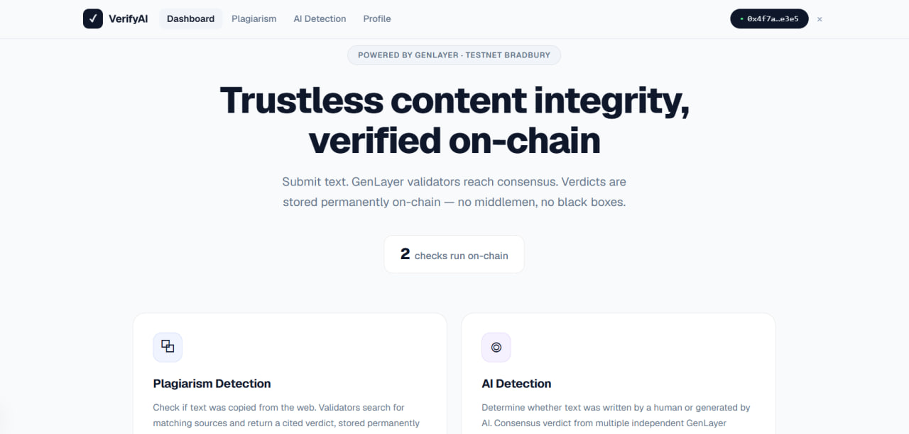
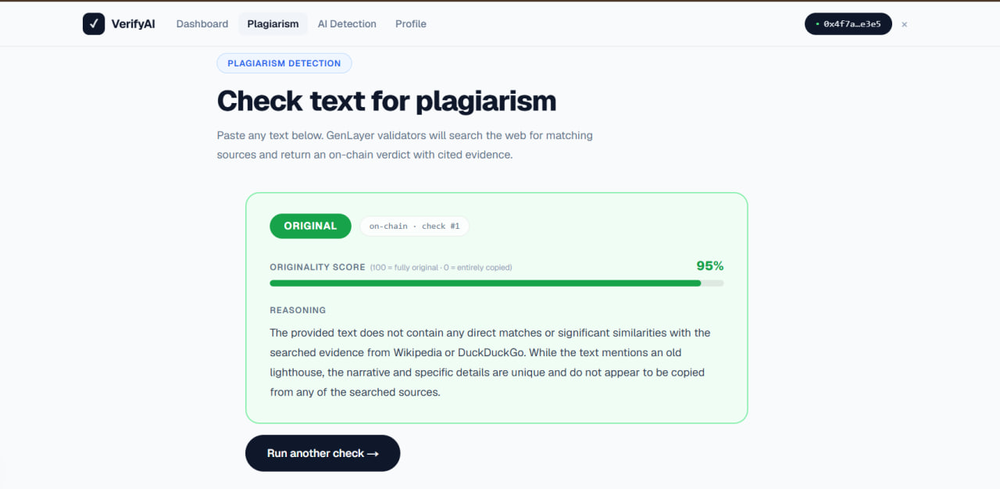
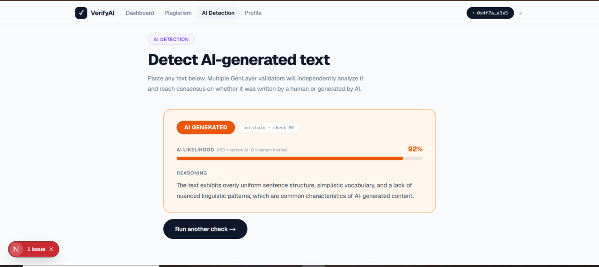

<div align="center">

# VerifyAI

### Trustless content integrity, verified on-chain

**Plagiarism detection + AI-writing detection, settled by AI validator consensus on GenLayer**

[Live App](https://verifyai-app-psi.vercel.app) · [How It Works](#how-it-works)



</div>

---

## What is VerifyAI?

VerifyAI is a trustless content integrity checker. Paste any text, and a set of AI validators issue an on-chain verdict on two questions:

1. **Plagiarism** — is this text copied from existing sources on the web?
2. **AI-writing detection** — does this read as human-written or AI-generated?

Today you trust Turnitin, Copyscape, or GPTZero — centralized black boxes that charge money and that you cannot verify or appeal. VerifyAI replaces the black box with neutral validator consensus: every verdict is produced by independent AI validators, agreed on-chain, and stored permanently with the reasoning and (for plagiarism) the sources that were found. Nobody can rig it, fake it, or quietly change it.

It runs live on GenLayer's Bradbury testnet.

---

## Why this is a GenLayer app

A plagiarism or AI-writing verdict is a *judgment call* — exactly the kind of subjective decision a normal smart contract can't make and a centralized API makes invisibly. VerifyAI uses GenLayer's two native superpowers together:

- **Live web access** — for plagiarism, validators check the text against real sources on the internet, with no external oracle.
- **AI judgment + consensus** — multiple validators independently reason about the text and must agree on the verdict before it's recorded.

The result is a content-integrity verdict that is **trustless, public, and permanent.**

---

## How it works

### Plagiarism check (web-powered)
The **leader validator searches the web once**, collects candidate sources, and that *same* evidence set is what every validator judges the text against — so they all reason over identical evidence and reach consensus, rather than each running a different search and diverging. The verdict, originality score, matched sources, and reasoning are stored on-chain.

### AI-writing detection (no web)
Validators judge the text's style, structure, and patterns directly — no web search needed — and agree on a binary HUMAN / AI_GENERATED verdict. Fast, clean consensus.

```
Paste text  →  choose Plagiarism or AI Detection  →  validators reach consensus  →  verdict stored on-chain
```

---

## Built for reliable consensus

Subjective verdicts are hard to reach agreement on, so VerifyAI is engineered specifically to make validator consensus converge:

- **AI detection consensus gates on the verdict category only** (HUMAN / AI_GENERATED), not on a confidence number — because confidence varies 30-50 points between identical model calls and would cause validators who actually agree to register as disagreeing.
- **Plagiarism validators vote AGREE / DISAGREE** on the leader's verdict rather than re-producing full JSON — eliminating the failure mode where a malformed JSON response silently counts as a "no" vote.
- **Leader-searches-once** guarantees every validator judges the same web evidence.

These choices mean verdicts reliably *resolve* instead of stalling as "undetermined."

---

## Privacy

Your submitted text is stored on-chain but **hidden from everyone except you.** The public feed shows verdicts, scores, reasoning, and sources — never the raw text someone submitted. Only the submitter's own address can read their original text back.



---

## The app

A clean four-page interface:

- **Dashboard** — what VerifyAI is, a public feed of recent verdicts (text hidden), and your own activity.
- **Plagiarism** — paste text, get a web-sourced verdict with an originality score and matched sources.
- **AI Detection** — paste text, get a HUMAN / AI_GENERATED verdict with reasoning.
- **Profile** — your wallet, stats, and your full check history.



---

## Tech stack

| Layer | Choice |
|-------|--------|
| Contract | Single Python Intelligent Contract on GenLayer (Bradbury testnet) |
| Testing | Direct-mode tests with mocked LLM — both checks, injection attempt, privacy gate; 7 tests |
| Frontend | Next.js, deployed on Vercel |
| Chain access | genlayer-js, separate read/write clients, cached reads, rate-limit-safe, reads at ACCEPTED |
| Wallet | Standard wallet-connect (Rabby + MetaMask) via EIP-3085 |
| Privacy | On-chain text gated to submitter only; public feed omits text |

---

## Notable engineering details

- **Leader-searches-once web consensus** — proven live: validators reached an identical result hash judging the same web evidence.
- **Injection-hardened** — submitted text is treated as untrusted data; a user pasting "rule this original" cannot hijack the verdict.
- **Consensus reliability fixes** — verdict-category-only equivalence and one-word validator voting, so checks resolve instead of going undetermined.
- **Honest async UX** — GenLayer consensus takes 1-2 minutes; the app reads at ACCEPTED (not the hours-long FINALIZED window) and clearly communicates the wait, and shows a real terminal state if validators genuinely can't agree.

---

## Running it locally

```bash
# Frontend
cd frontend
npm install
npm run dev          # http://localhost:3000

# Contract tests (direct mode)
genlayer test        # both checks + injection + privacy gate, mocked LLM
```

The deployed contract address is set in `frontend/src/lib/clients.ts`. Point a wallet at GenLayer Bradbury testnet to try it live.

---

## Status

Live and working end-to-end on Bradbury: both checks, reliable validator consensus, the privacy gate, the public feed, and the full four-page interface. The novel part — AI validators reading real text (and real web sources) and reaching a trustless, permanent verdict — runs on-chain today.

---

<div align="center">

**Built on [GenLayer](https://genlayer.com) — the adjudication layer for the agentic economy.**

</div>
